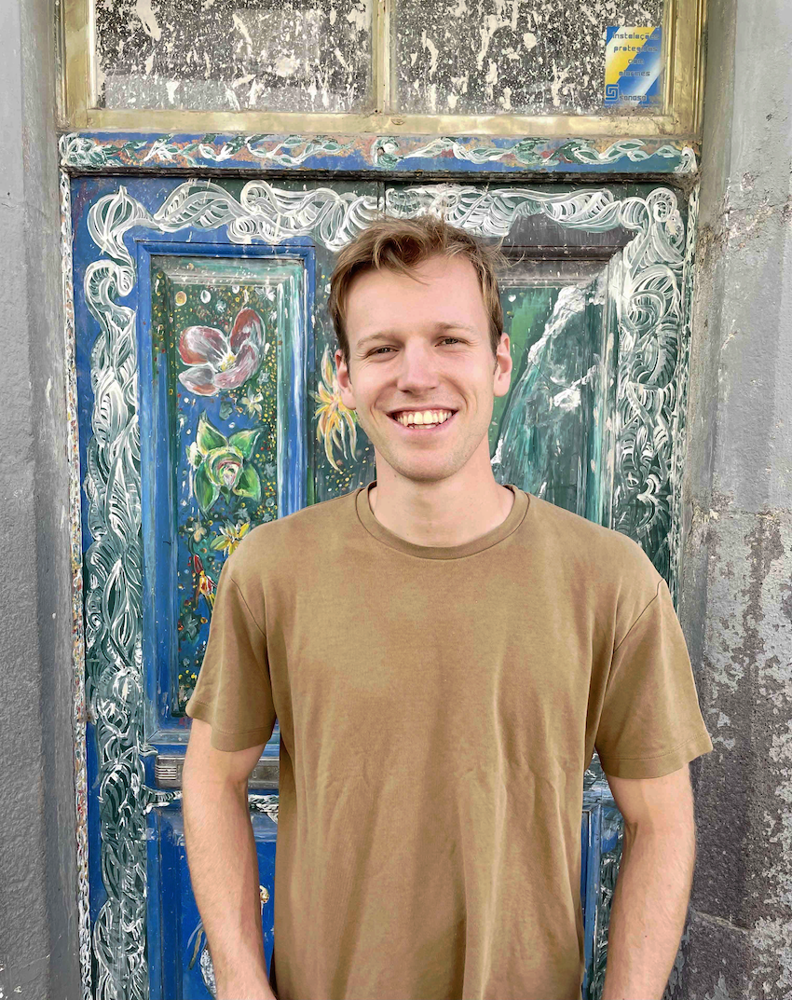
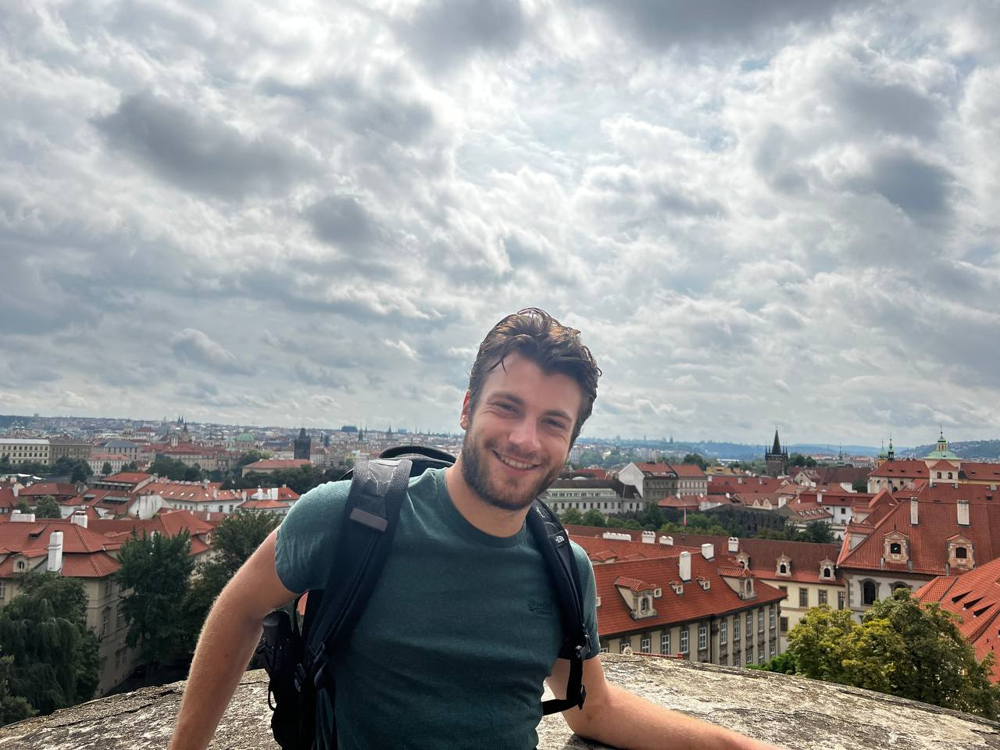

<!-- 
 -->
<!--    -->
<!-- 
 -->

# Computational Psychology and Computational Methods Lab
### *Understanding Human Behaviour through Experiments, Data, and Computational Methods*

---

## About the Lab

The **Computational Psychology and Computational Methods Lab (CPCM Lab)** focuses on the use of computational approaches to study the human mind and behaviour.  

Our work is cross-disciplinary and seeks to answer two questions: 

1. **How can computational methods enhance our understanding of the human mind and behaviour?**
2. **How can psychological research methods inform our understanding of computational model behaviour?**

We collect data in **psychological experiments** and develop and apply techniques from **natural language processing**, **machine learning**, and **statistical modelling** to better understand human behaviour and psychological processes.

Our lab brings together researchers with backgrounds in **Psychology, Computer Science, Neuroscience, Artificial Intelligence, Linguistics, Mathematics, Law,** and **Cognitive Science**.  

The CPCM Lab is based at the [Department of Methodology and Statistics](https://www.tilburguniversity.edu/about/schools/socialsciences/organization/departments/methodology-statistics) at Tilburg University.

---

## Lab updates

- [12/2025] We're running a special session at [XAI 2026](https://xaiworldconference.com/2026/) on [psychometrics applied to AI research](https://xaiworldconference.com/2026/psychometric-applications-for-xai/). CfP open soon. Contact me or the lead organisers [Sanne Peereboom](https://sannepeereboom.com/) and [Nicola Rossberg](https://www.crt-ai.ie/team/nicola-c-rossberg/)
- [11/2025] We've launched our 2-year master track [AI for Psychological Research](https://www.tilburguniversity.edu/education/masters-programs/artificial-intelligence-psychological-research). If you're interested in applying or have got other questions, please reach out.
- [10/2025] Our special issue in Legal and Criminological Psychology on the [Impact of Artificial Intelligence and New Technologies on Legal and Criminological Psychology](https://bpspsychub.onlinelibrary.wiley.com/hub/journal/20448333/call-for-papers/si-2025-001204) is open for submissions. For any questions, reach out to me or Riccardo Loconte.

---

## People

::: {.people-grid}

::: {.person-card}

### Bennett Kleinberg 
**Associate Professor, Lab director**

::: {.person-links}
🌐 [Website](https://bkleinberg.net)
:::

Computational methods in psychology, machine learning for behavioural data, and methodological foundations of computational social science.
:::

::: {.person-card}

### Riccardo Loconte
**Postdoc**

::: {.person-links}
🌐 [Website](https://www.linkedin.com/in/riccardo-loconte-5a7a20181)
:::

*Opportunities and challenges of automated verbal deception detection*

This project investigates how and to what extent computational approaches stemming from machine learning and natural language processing can advance verbal deception detection at large-scale.

:::

::: {.person-card}

### Sanne Peereboom
**Doctoral Researcher**

::: {.person-links}
🌐 [Website](https://sannepeereboom.com/)
:::

*Assessing the artificial mind through the marriage of natural language processing and psychometrics*

My project is focused on understanding generative language models through psychological measurement frameworks. My work focuses on if – and how – psychometric approaches can be used to validly assess the behaviour of these models

:::

::: {.person-card}

### John Caffier
**Doctoral Researcher**

::: {.person-links}
🌐 [Website](https://www.john-caffier.com)
:::

*Computational methods to measure, understand, and influence prosocial behavior and trust*

In our project, we apply and develop methods and tools to measure and model the dynamics of trust and prosocial behaviors - individually and at scale. Also, we explore how LLMs, apps, and other technologies, as well as humans, can actively influence these behaviors in potentially harmful or potentially constructive directions.

:::

::: {.person-card}

### Rasoul Norouzi Nikjeh
**Doctoral Researcher**

::: {.person-links}
🌐 [Website](https://rasoulnorouzi.github.io/)
:::

*Text-mining methods for theory development in psychological and social science research*

My PhD project develops text mining methods to automatically detect and parse causal claims in social science texts. It turns unstructured prose into structured who-causes-what representations and encodes them as Directed Acyclic Graphs (DAGs). This lets researchers identify recurring causal patterns, generate testable hypotheses, and conduct transparent evidence synthesis and theory refinement.

:::

::: {.person-card}

### Jennifer Chen
**Doctoral Researcher**

*Adolescent-Specific Assessment and Psychotherapy (ASAP): Innovating Idiographic Methods for Youth-Tailored Care*
:::

::: {.person-card}

### Tijn van Hoesel
**Doctoral Researcher**

::: {.person-links}
🌐 [Website](https://www.tilburguniversity.edu/nl/medewerkers/t-g-l-vanhoesel)
:::

*Spin: Questionable Research Practices in Scientific Reporting*

Investigating the concept of spin (primarily found in biomedicine) and relating it to the concept of questionable research practices (primarily found in psychology). Investigating the prevalence and impact of spin in psychological research.

:::

::: {.person-card}

### Weng Lam Ao
**Doctoral Researcher**

*Understanding decision-making in transport behaviour through social media data*

:::

::: {.person-card}

### Jari Zegers
**Thesis student / research assistant**

::: {.person-links}
🌐 [Website](https://www.linkedin.com/in/jari-zegers-5458ab190)
:::

*Psychological theories of deception and deception detection*

As part of my master’s thesis, this project aims to improve our understanding of deception and deception detection from a psychological perspective. 

:::

::: {.person-card}

### Lucca Pfründer
**Thesis student**

::: {.person-links}
🌐 [Website](https://www.researchgate.net/profile/Lucca-Pfruender)
:::

*Misleading Deception Classifiers with Model-Based and Human Paraphrasing Attacks*

This project investigates whether automated deception classifiers (machine learning) are vulnerable to intentional modification of credibility statements. We also investigate how humans and large language models think those systems understand credibility.

:::

::: {.person-card}

### Qian Chen
**Visiting Doctoral Researcher (Central China Normal University)**

::: {.person-links}
🌐 [Website](https://scholar.google.com/citations?user=bJeKuokAAAAJ&hl=en)
:::

*Decoding distorted interpretations of ambiguity from text data*

Everyday life is full of ambiguous social situations, and biased / inflexible interpretations of these situations are linked to depression and anxiety. Our work focuses on leveraging linguistic indicators of interpretation processes to improve understanding, measurement, and intervention methods that are more ecologically valid and translatable to real-world mental health.

:::

::: {.person-card}

### Jonas Festor
**Research assistant**

::: {.person-links}
🌐 [Website](https://www.linkedin.com/in/jonas-festor/)
:::

*Simulated vs. genuine empathy*

This project tries to disentangle human perceptions of LLM generated empathetic text from the ‘objective’ convincingness. This study builds on and tries to extend the investigation of [stochastic empathy](https://arxiv.org/abs/2410.01675).
:::

::: {.person-card}

### Ivo Snels
**Research assistant**

*Simulated vs. genuine empathy*

This project tries to disentangle human perceptions of LLM generated empathetic text from the ‘objective’ convincingness. This study builds on and tries to extend the investigation of [stochastic empathy](https://arxiv.org/abs/2410.01675).

:::

<!-- ::: {.person-card} -->
<!--  -->

<!-- ### Stefana Vida -->
<!-- **Research assistant** -->

<!-- *TEXT* -->

<!-- Description -->

<!-- ::: -->

:::

---

## Research

The CPCM Lab investigates how **computational methods can enhance our understanding of the human mind and behaviour**, and how **psychological research can inform our understanding of computational models**.

### Research Themes

#### Deception Detection
- Integrating experimental data and computational methods to address the "hard problems" of deception research
- Examining how human adversarial machine learning can inform cognitive deception theory

#### Methodological advancements
Developing the methods needed to advance computational psychology research

- Secure and scalable methods for text anonymisation (e.g., [Textwash](https://github.com/ben-aaron188/textwash))
- Sample size estimation algorithms for supervised machine learning

#### Machine Beahviour
- Understanding stochastic humanness of large language models through experimental research
- Using formal psychometric modelling to study the behaviour of artificial intelligence models and how it reflects or diverges from human behaviour and cognition.

#### Computational Psychology with Natural Language Processing

Using computational text analysis to study and predict psychological constructs in humans (e.g., cynicism, emotion, deception)

---

## PhD alumni of the lab

- Dr. Isabelle van der Vegt, _Understanding and predicting threats of violence using computational linguistics_ (supervision with Prof Paul Gill) - completed in 1/2021, positions: Scientific project manager at [WODC](https://english.wodc.nl/) $\rightarrow$ Assistant Professor in Computational Social Science at Utrecht University, NL. [www](https://isabellevdv.net/)
- Dr. Felix Soldner, _Detecting and mitigating online customer fraud_ (supervision with Prof Shane Johnson) - completed in 6/2023, positions: postdoc at Leibniz Institute GESIS, Cologne, Germany $\rightarrow$ Forensic Service consultant at PWC. [www](https://www.fsoldner.net/)
- Dr. Maximilian Mozes, _Adversarial perturbations in natural language processing_ (supervision with Prof Lewis Griffin) - completed in 12/2023, position: Senior Research Scientist and team lead at [Cohere AI](https://cohere.com/), London. [www](https://mmozes.net/)
- Dr. Arianna Trozze, _New forms of financial crime_ (supervision with Dr. Toby Davies) - completed: 12/2023, position: Senior Cryptocurrency Intelligence Scientist at [Elliptic](https://www.elliptic.co/), London. [www](https://ariannatrozze.github.io/)
- Dr. Daniel Hammocks, _Information prioritisation for horizon scanning using data science techniques_ (with Prof Kate Bowers) - completed in 5/2025, positions: Senior Data Scientist at the Mayor's Office for Policing and Crime (MOPAC), London $\rightarrow$ Principal Data Scientist at [MOPAC](https://www.london.gov.uk/programmes-strategies/mayors-office-policing-and-crime-mopac).

---

## Joining the lab

_How can I join the CPCM lab?_ 

Lab members are typically postdocs, PhD students, thesis students or research interns/assistants. **Thesis projects** are advertised in the programmes we are involved in. There are various routes for **PhD projects** (e.g., a funded position via university employment, a joint PhD with another university, self-funding). All positions that are connected to employment (typically for 4 years) are publicly advertised. If you are interested in a **research internship**, please identify a topic you are interested in that aligns with the lab's focus and is relevant to at least one other lab member. Reach out to Bennett via email then. Research internships should last at least 6 months since projects require a solid embedding in psychological research and computational methods..

---

## Contact

**Computational Psychology and Computational Methods Lab (CPCM Lab)**  
Dr. Bennett Kleinberg, Department of Methodology and Statistics, Tilburg University, The Netherlands

📧 [mailto:&#98;&#101;&#110;&#110;&#101;&#116;&#116;&#46;&#107;&#108;&#101;&#105;&#110;&#98;&#101;&#114;&#103;&#64;&#116;&#105;&#108;&#98;&#117;&#114;&#103;&#117;&#110;&#105;&#118;&#101;&#114;&#115;&#105;&#116;&#121;&#46;&#101;&#100;&#117;]

---

© 2025 **CPCM Lab** — *Understanding Human Behaviour through Experiments, Data, and Computational Methods*
